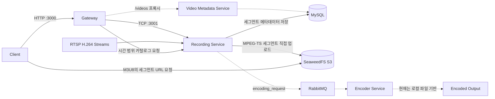

# Cam-Vault

Cam-Vault는 RTSP 기반 CCTV 영상을 녹화하고, 인코딩하고, 비디오 메타데이터를 관리하기 위한 서버입니다.<br>
현재 저장소에는 백엔드 스택이 포함되어 있으며, 외부 요청은 `gateway` 서비스로 들어옵니다. 전체 시스템은 Docker Compose로 한 번에 실행할 수 있습니다.


## 기존 녹화 서버와의 차이점

- 서버 클러스터에 컨테이너로 배포함
- 녹화·인코딩 서비스를 마이크로서비스로 분리해 독립적으로 확장 가능
- S3 호환 객체 스토리지를 통해 저장 용량을 독립적으로 확장 가능
- 녹화되는 영상을 세그먼트 단위로 S3 호환 객체 스토리지로 바로 전송


## 핵심 기능

- 녹화 기능 
- 시간대별 동영상 조회 기능 
- 라이브 스트리밍 데모
- RESTfull API 제공 
- S3호환 객체 스토리지 지원
- CI/CD 및 서버 배포

  
## 프로젝트 구조
camvault는 멀티 백엔드 서비스로 게이트웨이를 통해 다른 마이크로서비스로 접근하는 구조입니다.
각각의 마이크로서비스는 도커 스웜 환경에서 스탠드 얼론 서비스로 동작합니다.
하단은 camvault의 마이크로서비스 목록입니다.
- `gateway` (NestJS): REST API 게이트웨이 서비스
- `recording` (NestJS microservice): RTSP 동영상 스트림 녹화 서비스
- `encoder` (NestJS microservice): RabbitMQ 메시지를 받아 비디오 인코딩하는 서비스
- `video-metadata-service` (Spring Boot): 비디오 메타데이터 CRUD 서비스
- `mysql`: 비디오 메타데이터 저장
- `rabbitmq`: 비동기 메시지 브로커
- `storage`: S3객체 스토리지
  
게이트웨이와 마이크로서비스들은 도커 내부 네트워크로 연결되며, 기본 설정에서는 호스트 포트를 직접 열지 않습니다.


## API 설명
라이브 스트리밍 데모를 제외한 기능은 REST API로 제공됩니다.<br>
REST API<br>
<스웨거UI 링크><br>
라이브 스트리밍 데모<br>
<라이브 스트리밍 데모>


## 빠른 시작
### 0. 사전 요구사항
클러스터에 도커 스웜이 깔려있다는 전제 하에 설명하였습니다.
매니저 노드에서 다음 절차에 따라 명령어를 실행하시면 됩니다.

### 1. 컴포즈 파일 기반 실행

스택 파일(`cam-vault.stack.yaml`)기반으로 클러스터에 배포합니다.(`http://localhost:3000`에서 서버가 시작됩니다.)
```bash
sudo docker stack deploy --compose-file cam-vault.stack.yaml camvault
```

### 2. 상태 확인

현재 클러스터에 배포된 스택을 확인합니다.

```bash
sudo docker stack ps camvault
```

### 3. 종료

클러스터에서 배포된 스택을 제거합니다.

```bash
sudo docker stack rm camvault
```


## 세부사항


## 배포 전 확인 사항

- 현재 placement constraint는 `manager`와 `worker`를 구분합니다. 최소 1개의 manager 노드와 1개의 worker 노드가 필요합니다.
- MySQL은 외부 Swarm config인 `cam-vault-mysql-init`을 요구합니다. 최초 배포 전에 manager 노드에서 다음과 같이 등록합니다.

  ```bash
  sudo docker config create cam-vault-mysql-init init.sql
  ```

- `cam-vault.stack.yaml`의 `seaweed_data`는 특정 worker 호스트의 절대 경로에 bind됩니다. `volumes.seaweed_data.driver_opts.device`를 배포 서버 경로에 맞게 수정하고 디렉터리를 미리 준비해야 합니다.
- 애플리케이션 서비스는 GHCR의 `develop` 태그 이미지를 사용하므로 클러스터 노드에서 해당 이미지를 pull할 수 있어야 합니다.
- 스택을 제거하는 실제 명령은 다음과 같습니다.

  ```bash
  docker stack rm camvault
  ```

## 아키텍처

실선은 현재 녹화·조회 경로를, 점선은 코드가 존재하지만 end-to-end 연결 보완이 필요한 경로를 나타냅니다.



Swarm 기본 스택에서는 `video-metadata-service`가 주석 처리되어 있으므로 `/videos` 프록시 경로는 별도 활성화 전까지 사용할 수 없습니다. 녹화 서비스가 직접 사용하는 세그먼트 메타데이터 모델과 Spring 서비스의 메타데이터 모델도 아직 통합되지 않았습니다.

## 현재 녹화 및 조회 흐름

현재 코드에 연결된 주 흐름은 다음과 같습니다.

1. `recording` 서비스가 시작되면 `RECORDING_STREAMS`에 등록된 각 RTSP 주소에 TCP로 연결합니다. 현재 녹화 엔진은 H.264 스트림만 지원합니다.
2. H.264 access unit을 키프레임 경계에서 나누고 MPEG-TS 형식으로 mux합니다. 실제 세그먼트 길이는 키프레임 간격에 따라 설정값보다 길어질 수 있습니다.
3. 완성되는 세그먼트 stream을 로컬 원본 파일로 저장하지 않고 S3 API를 통해 `storage`에 바로 업로드합니다.
4. 업로드가 끝나면 RTSP URL, 세션 ID, 세그먼트 번호, Bucket, Key, 시작·종료 시각을 MySQL에 저장합니다.
5. Gateway는 지정한 시간 범위의 메타데이터를 조회해 EVENT 형식의 M3U8 재생 목록을 만들고, HLS.js 기반 데모 페이지에서 이를 재생합니다.

따라서 현재 구현 기준의 주 흐름은 `RTSP 녹화 → S3 세그먼트 업로드 → 메타데이터 저장 → 시간 범위 HLS 조회`입니다.

RabbitMQ 인코딩 요청, encoded 객체 재업로드, S3 원본 삭제, encoded 상태 갱신 코드는 아직 하나의 end-to-end 흐름으로 연결되어 있지 않습니다. 현재 S3에 업로드된 원본 `.ts` 객체는 자동으로 삭제되지 않습니다.

## 스토리지 구조

Swarm 배포에서는 SeaweedFS가 S3 호환 객체 스토리지 역할을 합니다. recording 서비스는 스트림 순서에 따라 `stream1`, `stream2`, ... Bucket을 만들고 아래 형식으로 객체를 저장합니다.

```text
stream1/
`-- <session-uuid>-<segment-started-at>.ts
```

예를 들어 세그먼트 시작 시각의 `:`와 `.`은 `-`로 치환됩니다.

```text
stream1/550e8400-e29b-41d4-a716-446655440000-2026-09-03T12-34-56-789Z.ts
```

`cam-vault.stack.yaml`의 `seaweed_data`는 현재 특정 worker 호스트의 절대 경로에 bind되도록 설정되어 있습니다. 배포 환경에 맞게 `volumes.seaweed_data.driver_opts.device`를 수정해야 하며, 여러 worker 사이에서 storage task가 이동할 경우에도 같은 데이터에 접근할 수 있도록 배치와 스토리지 정책을 구성해야 합니다.

루트의 `./storage` 디렉터리는 로컬 `docker-compose.yml`에서 recording과 encoder 컨테이너에 bind되지만, 현재 recording 엔진의 S3 원본 저장 위치는 아닙니다. Swarm의 recording과 encoder 서비스에는 이 공유 bind mount가 없습니다.

## Swarm 서비스와 게시 포트

| 서비스 | 게시 포트 | 배치 | 비고 |
| --- | ---: | --- | --- |
| `gateway` | `3000` | manager | 외부 REST API, Swagger, HLS 데모 |
| `recording` | `3001` | worker | Gateway와 통신하는 NestJS TCP microservice |
| `mysql` | `3306` | worker | 현재 호스트에 게시됨 |
| `adminer` | `8080` | manager | 데이터베이스 관리 UI |
| `rabbitmq` | `5672` | worker | AMQP 포트, 관리 UI `15672`는 Swarm 스택에서 게시하지 않음 |
| `storage` | `8333` | worker | SeaweedFS S3 API |
| `storage-admin` | `23646` | manager | SeaweedFS 관리 서비스 |
| `encoder` | 없음 | worker | RabbitMQ consumer |
| `video-metadata-service` | 비활성 | worker 예정 | 현재 Swarm 스택에서 주석 처리됨 |

운영 환경에서는 `gateway` 외 포트를 public network에 그대로 노출하지 않는 구성을 권장합니다.

## 환경 변수

기본 예시는 [.env.example](./.env.example)에 있습니다. 다만 `.env.example`, 로컬 `docker-compose.yml`, `cam-vault.stack.yaml`의 기본값과 변수 이름이 일부 다르므로 배포 전에 실제 대상 파일을 기준으로 확인해야 합니다.

| 변수 | 현재 용도 | 참고 |
| --- | --- | --- |
| `GATEWAY_PORT` | Gateway HTTP 포트로 의도 | 현재 배포 파일은 사용하지 않고 `3000`을 직접 지정 |
| `MYSQL_ROOT_PASSWORD` | MySQL root 비밀번호 | 운영 배포 전 반드시 변경 |
| `DB_NAME` | 데이터베이스 이름 | `.env.example`과 Swarm fallback 값이 다름 |
| `DB_USERNAME`, `DB_PASSWORD` | 서비스 DB 계정 | 현재 기본 구성은 root 계정을 사용하므로 운영용 계정 분리 필요 |
| `DB_SYNCHRONIZE` | TypeORM schema 자동 동기화 | recording과 encoder의 기본 동작이 서로 다름 |
| `RABBITMQ_DEFAULT_USER`, `RABBITMQ_DEFAULT_PASS` | RabbitMQ 계정 생성 | `RMQ_URL`의 계정과 반드시 일치해야 함 |
| `RMQ_URL` | recording의 RabbitMQ 접속 URL | `.env.example`에는 없음 |
| `RMQ_QUEUE_NAME` | recording이 사용할 queue 이름 | 기본 의도는 `encoding_queue` |
| `RECORDING_STREAMS` | 쉼표로 구분한 RTSP URL 목록 | 서비스 시작 시 각 주소에 연결 |
| `VIDEO_LENGTH` | Swarm에서 `RECORDING_SEGMENT_LENGTH`로 전달 | `.env.example`은 `10`, Swarm fallback은 `30` |
| `RECORDING_CRON` | 녹화 cron 식 | 현재 활성 녹화 경로는 시작 시 지속 연결하므로 사용되지 않음 |
| `RECORDING_TZ` | recording 및 encoder 시간대 | Swarm fallback은 `Asia/Seoul` |
| `S3_ENDPOINT`, `S3_REGION` | S3 endpoint와 region | Swarm fallback은 내부 `storage:8333` 및 `us-east-1` |
| `S3_FORCE_PATH_STYLE` | path-style S3 URL 사용 여부 | SeaweedFS 기본 구성에서는 `true` |
| `S3_CREDENTIALS_ACCESS_KEY_ID`, `S3_CREDENTIALS_SECRET_ACCESS_KEY` | S3 자격 증명 | 스택의 개발용 기본 자격 증명을 운영 전에 교체 |

SeaweedFS와 RabbitMQ의 개발용 자격 증명이 스택 파일에 포함되어 있습니다. 운영 환경에서는 Docker secrets 또는 별도의 안전한 설정 주입 방식을 사용하세요.

## API 요약

- Swagger UI: [http://localhost:3000/api/](http://localhost:3000/api/)
- OpenAPI 명세: [http://localhost:3000/api/openapi.yaml](http://localhost:3000/api/openapi.yaml)
- HLS 스트리밍 데모: [http://localhost:3000/recording/videos/0](http://localhost:3000/recording/videos/0)

### 현재 구현된 recording 조회 API

| Method | Path | 설명 |
| --- | --- | --- |
| `GET` | `/recording/healthz` | recording microservice 상태 확인 |
| `GET` | `/recording/config` | 전체 녹화 설정 조회 |
| `GET` | `/recording/config/rtsp/urls` | 등록된 RTSP URL 목록 조회 |
| `GET` | `/recording/config/segmentLength` | 세그먼트 길이 조회 |
| `GET` | `/recording/config/Bucket` | 현재 `storage.targetDir` 설정 조회 |
| `GET` | `/recording/config/rabbitmq/urls` | RabbitMQ 접속 URL 조회. 자격 증명이 포함될 수 있으므로 외부 공개 금지 |

### 조건부로 동작하거나 보완이 필요한 API

| Method | Path | 현재 상태 |
| --- | --- | --- |
| `GET` | `/recording/config/rtsp/urls/:id` | Gateway와 recording 사이 payload 형식이 달라 보완 필요 |
| `POST` | `/recording/config/rtsp/urls` | payload 형식 불일치. 변경값도 재시작 후 유지되지 않음 |
| `DELETE` | `/recording/config/rtsp/urls/:id` | payload 형식 불일치로 삭제 흐름 보완 필요 |
| `POST` | `/recording/config/segmentLength` | payload 형식 불일치. 실행 중인 연결 재구성도 없음 |
| `POST` | `/recording/config/Bucket` | payload 형식 불일치. 현재 활성 stream의 Bucket에도 반영되지 않음 |
| `GET` | `/recording/video-catalog/:streamID?start=&end=` | M3U8 생성 구현은 있으나 segment URL의 storage host가 하드코딩됨 |
| `GET` | `/recording/videos/:id` | HLS.js 데모. 위 카탈로그와 storage 접근이 정상일 때 사용 가능 |
| `GET` | `/videos` | metadata service proxy. Swarm 기본 스택에서는 대상 서비스가 비활성 |
| `GET` | `/videos/:uuid` | metadata service가 별도로 실행 중일 때 사용 가능 |
| `POST` | `/videos` | Gateway request body binding이 구현되지 않음 |
| `GET` | `/videos/:uuid/encoding-status` | encoded 상태가 DB에 영속화되지 않아 현재 의미 있는 상태 조회 불가 |
| `DELETE` | `/videos/:uuid` | metadata row만 삭제하며 S3 객체는 삭제하지 않음 |

이전 초안에 있던 `GET /recording`과 `PUT /recording/config` 라우트는 현재 코드에 존재하지 않습니다.

## 사용 예시

### recording 상태 확인

```bash
curl http://localhost:3000/recording/healthz
```

### 현재 녹화 설정 조회

```bash
curl http://localhost:3000/recording/config
```

응답 예시:

```json
{
  "streams": [
    "rtsp://camera.example.com/live/main"
  ],
  "targetDir": "/app/storage/recordings",
  "segmentLength": 30
}
```

`targetDir`는 현재 설정 API가 반환하는 값이며, 실제 시작 시 생성되는 S3 Bucket 이름은 `stream1`, `stream2`, ... 형식입니다.

### 시간 범위 HLS 재생 목록 조회

`start`와 `end`에 RFC 3339 시각을 전달합니다. 문자열 `0`을 사용하면 Gateway가 현재 시각 기준 기본 범위를 계산합니다.

```bash
curl "http://localhost:3000/recording/video-catalog/0?start=0&end=0"
```

### HLS 데모 열기

```text
http://localhost:3000/recording/videos/0
```

## CI 및 이미지 배포

`.github/workflows/continous-integration.yml`은 `main` 또는 `develop` 대상 pull request와 수동 실행에서 다음 작업을 수행합니다.

1. 저장소 변수로 정의된 Node.js 버전·서비스 matrix별 `npm ci` 및 unit test 실행
2. 서비스별 컨테이너 이미지 빌드 및 GHCR push
3. 빌드한 이미지의 artifact attestation 생성

현재 workflow에는 Docker Swarm 서버로 자동 배포하는 job이 없습니다. 서버 배포는 `cam-vault.stack.yaml`을 이용해 별도로 수행해야 합니다.

## 프로젝트 파일 구조

```text
.
|-- gateway/                       # HTTP Gateway, Swagger, HLS demo
|-- recording/                     # RTSP recording, S3 upload, catalog
|   `-- packages/yellowstone/      # RTSP/RTP client
|-- encoder/                       # RabbitMQ consumer, FFmpeg encoding
|-- video-metadata-service/        # Spring Boot metadata API
|-- docker/mysql/init/             # local Compose MySQL init SQL
|-- docs/                          # architecture and requirement documents
|-- storage/                       # local Compose bind directory
|-- .github/workflows/             # CI workflow
|-- cam-vault.stack.yaml           # Docker Swarm stack
|-- docker-compose.yml             # local integration configuration
|-- docker-compose.dev.yml         # development configuration
|-- docker-compose.test.yml        # test configuration
|-- init.sql                       # recording metadata schema
`-- .env.example
```
